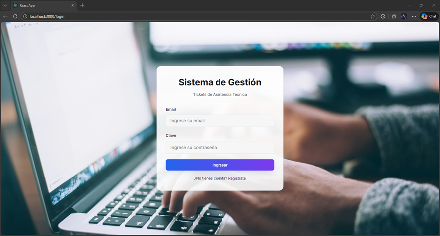
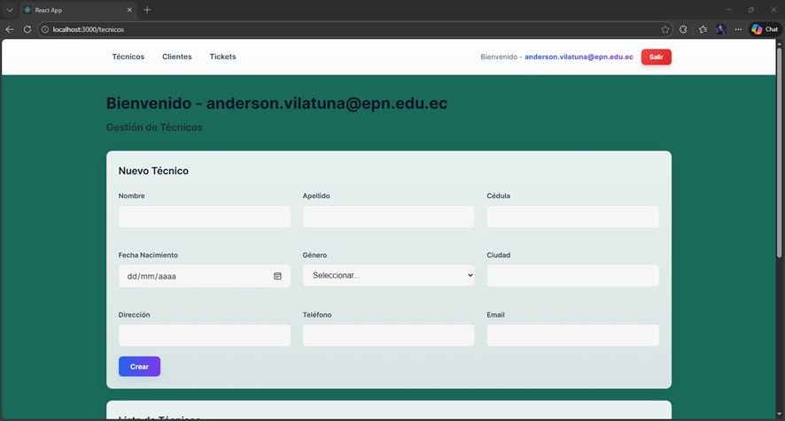
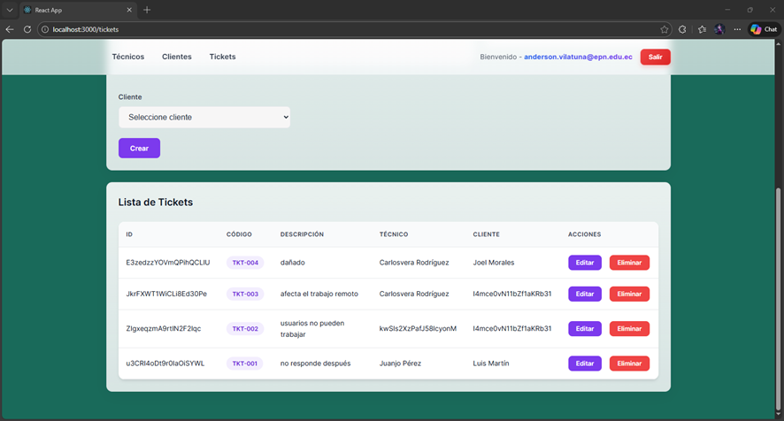
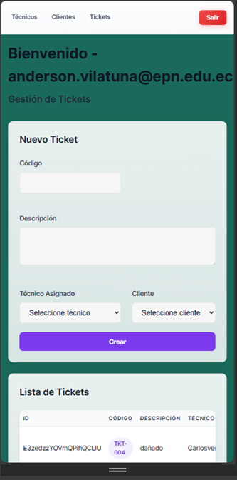

# Tickets Frontend

## 🚀 Demo en línea

Prueba la aplicación aquí: [Ver Demo](https://tickets-frontend-orpin.vercel.app/tecnicos)

Este proyecto es la interfaz de usuario para la gestión de tickets de soporte técnico. Permite a los usuarios registrar, visualizar y administrar tickets, así como gestionar clientes y técnicos.

## Características principales

- Autenticación de usuarios (login y registro)
- Gestión de tickets de soporte
- Administración de clientes y técnicos
- Integración con Firebase para autenticación y base de datos
- Interfaz moderna y responsiva

## Estructura del proyecto

```
public/
  index.html
  manifest.json
  robots.txt
src/
  App.js
  index.js
  assets/
    img/
  auth/
    AuthContext.js
  components/
    Navbar.js
  firebase/
    auth.js
    config.js
    services.js
  pages/
    Clientes.js
    Login.js
    Register.js
    Tecnicos.js
    Tickets.js
  services/
    api.js
  utils/
    clearAndSeed.js
    seedData.js
```

## Instalación

1. Clona el repositorio:
   ```bash
   git clone <url-del-repositorio>
   ```
2. Instala las dependencias:
   ```bash
   npm install
   ```
3. Configura las variables de entorno de Firebase en `src/firebase/config.js`.
4. Inicia la aplicación:
   ```bash
   npm start
   ```

## Scripts disponibles

- `npm start`: Inicia la aplicación en modo desarrollo.
- `npm run build`: Genera una versión optimizada para producción.
- `npm test`: Ejecuta los tests (si están configurados).

## Tecnologías utilizadas

- React
- Firebase
- JavaScript (ES6+)
- CSS

## Contribución

¡Las contribuciones son bienvenidas! Por favor, abre un issue o un pull request para sugerencias o mejoras.
## Vista previa de la aplicación

### Pantalla de Login


### Gestión de Técnicos


### Gestión de Tickets


### Diseño Responsive (Móvil)



